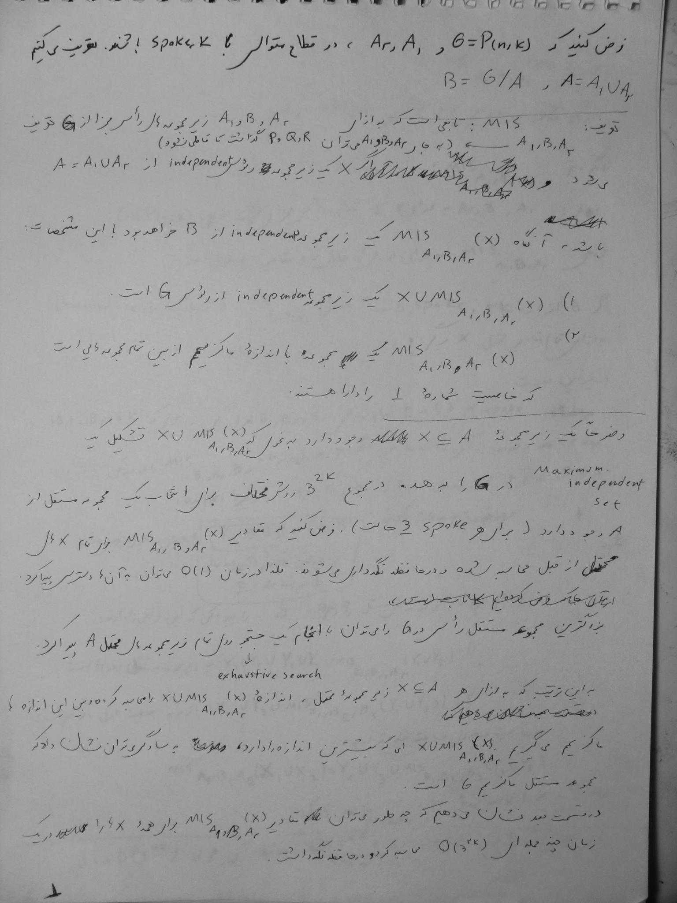
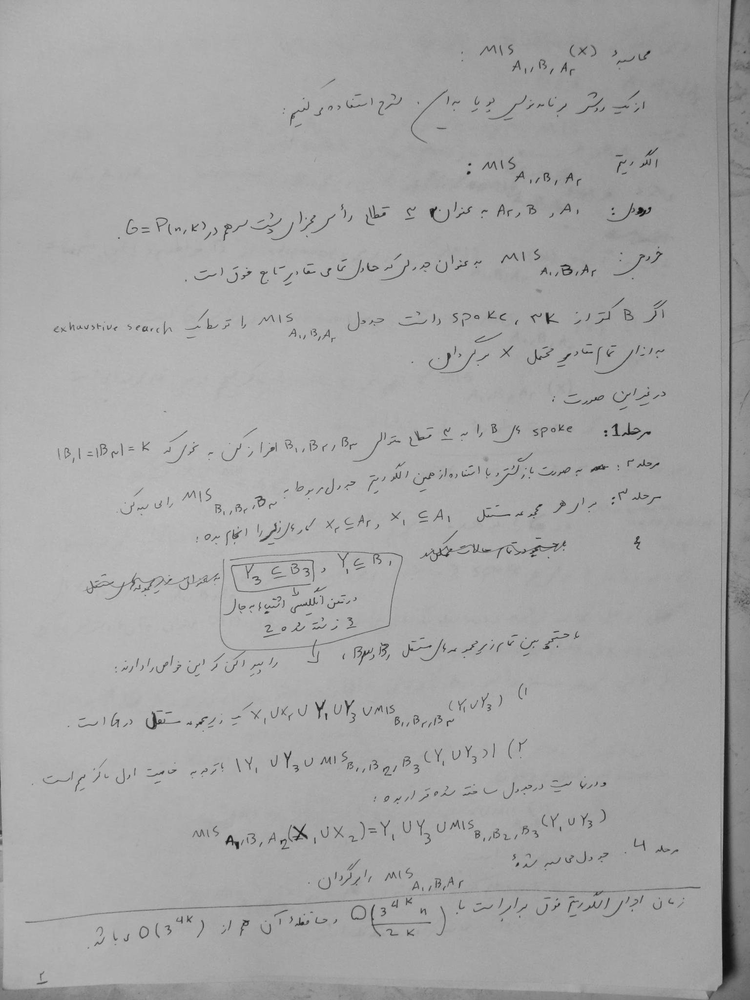

# GPetersonMIS — Independence Number of Generalized Petersen Graphs

A computational study of the **Maximum Independent Set (MIS)** problem on **Generalized Petersen Graphs**, based on the paper:

> **"Independence number of generalized Petersen graphs"**
> by A. Azadi, N. Besharati, and J. Ebrahimi B. (March 9, 2010)
>
> *Included in this repository as `independence 43.pdf`*

---

## Background

### The Maximum Independent Set Problem

In a graph *G = (V, E)*, an **independent set** *I(G)* is a subset of vertices such that no two vertices in the set are adjacent. The **independence number** *α(G)* is the cardinality of a largest independent set. Finding the maximum independent set is a well-known **NP-hard** problem, so research focuses on finding upper and lower bounds, or exact values for special classes of graphs.

### Generalized Petersen Graphs

For each *n* and *k* (where *n > 2k*), a **Generalized Petersen graph P(n, k)** is defined by:

- **Vertex set:** {u₁, u₂, …, uₙ} ∪ {v₁, v₂, …, vₙ} (total of 2n vertices)
- **Edge set:** {uᵢuᵢ₊₁, uᵢvᵢ, vᵢvᵢ₊ₖ} for i = 1, 2, …, n (subscripts reduced modulo n)

The graph consists of:
- An **outer cycle** (induced subgraph on the u-vertices)
- An **inner subgraph** (induced subgraph on the v-vertices)
- **Spokes** connecting each uᵢ to its twin vᵢ



### Key Results from the Paper

The paper establishes upper and lower bounds for *α(P(n, k))* and proves exact values for specific cases:

| Case | Independence Number α(P(n,k)) |
|------|-------------------------------|
| P(n, 2) | ⌊n/4⌋ · 2 + n mod 4 related formula |
| P(n, 1) | ⌊n/2⌋ (bipartite case) |
| P(n, 3) | Exact formulas depending on n mod 8 |
| Both n, k odd | α ≥ n⁽ᵏ⁺¹⁾/⁽²ᵏ⁾ |
| Even k ≥ 2·⌊n/4⌋ | α ≥ n + ⌊n/(2k)⌋ |
| Even k < 2·⌊n/4⌋ | α ≥ n + ⌊n/(2k)⌋ + 2k |
| General even k (≥ 2) | Upper bound proved |

A key conjecture addressed (from reference [1]): **α(P(n,k)) ≤ n + ⌈n/5⌉** for all n and k.

The authors verified this conjecture computationally for all *n < 78* and proved it for some cases.



---

## Repository Structure

```
GPetersonMIS/
├── independence 43.pdf      # The research paper
├── paper_approach/
│   ├── mis.cpp              # Main algorithm: divide-and-conquer MIS solver
│   └── test_bit_set.cpp     # Bitset utility tests
├── exh_mis.c                # Exhaustive MIS search using igraph library
├── erdos.c                  # Erdős–Rényi random graph + igraph MIS
├── erdos.cpp                # Erdős–Rényi random graph generation (Boost MPI)
├── coloring.cpp             # Distributed graph coloring (Boost MPI)
├── mis_par.cpp              # MPI "Hello World" test for Boost.MPI setup
├── image.png                # Generalized Petersen graph diagram
├── image2.png               # Graph segment illustration
└── README.md                # This file
```

---

## Code Descriptions

### `paper_approach/mis.cpp` — Core Algorithm (Divide and Conquer)

This is the **primary implementation** that follows the paper's algorithmic approach for computing the MIS of a Generalized Petersen graph P(n, k).

**How it works:**

1. **Graph Construction** (`generalized_peterson()`): Builds the adjacency matrix for P(n, k) with 2n vertices. For each vertex i in {0, …, m-1} (where m = n/2):
   - Outer cycle edge: `i → (i+1) mod m`
   - Spoke edge: `i → i + m`
   - Inner cycle edge: `(i+m) → ((i+k) mod m) + m`

2. **Subset Enumeration** (`subsets()`): Generates all subsets of a given size from an array (used for exhaustive search of smaller subproblems).

3. **Independent Set Verification** (`is_mis()`): Checks whether a given vertex subset is independent (no two vertices are adjacent).

4. **Spoke Counting** (`num_of_spokes()`): Counts how many "spoke" pairs (uᵢ, vᵢ) exist in a given vertex set — this is key to the divide-and-conquer strategy.

5. **Divide and Conquer MIS** (`MIS(A1, B, A2)`): The main recursive algorithm:
   - **Base case**: If the number of spokes in B is less than 3k, solve exhaustively via `exhaustive_mis()`.
   - **Recursive case**: Split B into three parts (B1, B2, B3) using `get_k_spokes()`, recursively solve MIS on the middle portion, then combine results by iterating over all independent sets of the boundary parts.

6. **Bitset Encoding** (`code()`, `only_code()`): Uses bitsets to compactly encode independent set configurations for efficient lookup during the combination phase.

**Parameters** (set as constants in the code):
- `m = 30` — number of vertices per cycle (this is *n* in the paper's P(n, k) notation)
- `k = 5` — inner cycle step size
- `n = 60` — total number of vertices (= 2 × m = 2 × 30), i.e., the adjacency matrix dimension

> **Note:** The code variable `n` refers to the *total* vertex count (2m), while the paper's *n* in P(n, k) refers to the number of vertices per cycle (the code's `m`). The graph constructed is **P(30, 5)** in the paper's notation.

### `exh_mis.c` — Exhaustive MIS with igraph

Uses the **igraph** C library to construct a Generalized Petersen graph P(30, 14) and compute its exact independence number via `igraph_independence_number()`.

- Constructs the edge list programmatically for outer cycle, spokes, and inner cycle
- Calls igraph's built-in exact solver
- Prints the independence number

### `erdos.c` — Erdős–Rényi Random Graph (igraph)

Generates an Erdős–Rényi random graph using igraph and computes its independence number. Contains commented-out code showing the random graph generation was replaced with the Generalized Petersen construction (same as `exh_mis.c`).

### `erdos.cpp` — Distributed Erdős–Rényi Graph (Boost.MPI)

Uses **Boost.Graph** with **MPI** (distributed computing) to generate a large-scale sorted Erdős–Rényi random graph with 1,000,000 vertices. This demonstrates the distributed graph infrastructure that could be applied to larger Petersen graph instances.

### `coloring.cpp` — Distributed Graph Coloring (Boost.MPI)

Implements **parallel graph coloring** using Boost's `boman_et_al_graph_coloring` algorithm on a distributed adjacency list. This is a related graph algorithm that could potentially be used to derive bounds on the independence number (since the independence number is related to the chromatic number).

### `mis_par.cpp` — MPI Communication Test

A simple Boost.MPI "Hello World" program to verify that the MPI environment is correctly configured before running the distributed algorithms.

### `paper_approach/test_bit_set.cpp` — Bitset Tests

A small utility to test C++ `std::bitset` and `std::vector<bitset>` operations, used during development of the bitset-encoded independent set lookup in the main algorithm.

---

## Dependencies

| Dependency | Used By | Purpose |
|------------|---------|---------|
| **C++ compiler** (g++) | All `.cpp` files | Compilation |
| **igraph** (C library) | `exh_mis.c`, `erdos.c` | Graph construction & exact MIS |
| **Boost.Graph** | `coloring.cpp`, `erdos.cpp` | Distributed graph algorithms |
| **Boost.MPI** | `coloring.cpp`, `erdos.cpp`, `mis_par.cpp` | MPI-based parallel computing |
| **MPI** (e.g., OpenMPI) | All MPI-based files | Message passing framework |

---

## Building and Running

### Core Algorithm (paper_approach/mis.cpp)

```bash
cd paper_approach
g++ -O2 -o mis mis.cpp
./mis
```

### igraph-based Programs

```bash
# Requires igraph to be installed
gcc -O2 -o exh_mis exh_mis.c -ligraph
./exh_mis

gcc -O2 -o erdos erdos.c -ligraph
./erdos
```

### MPI-based Programs

```bash
# Requires Boost and MPI to be installed
mpicxx -O2 -o coloring coloring.cpp -lboost_mpi -lboost_serialization
mpirun -np 4 ./coloring

mpicxx -O2 -o erdos_mpi erdos.cpp -lboost_mpi -lboost_graph_parallel -lboost_serialization
mpirun -np 4 ./erdos_mpi

mpicxx -O2 -o mis_par mis_par.cpp -lboost_mpi -lboost_serialization
mpirun -np 2 ./mis_par
```

---

## Algorithm Overview

The divide-and-conquer approach in `paper_approach/mis.cpp` works as follows:

```
MIS(A1, B, A2):
    if spokes(B) < 3k:
        exhaustively enumerate all independent sets of A = A1 ∪ A2
        for each independent set X of A:
            find the maximum independent set Y of B
            such that X ∪ Y is independent in G
        store results encoded as bitsets

    else:
        split B into (B1, B2, B3) with k spokes each
        recursively solve MIS(B1, B2, B3)
        enumerate independent sets of A1, A2, B1, B3
        combine with stored recursive results
        return maximum combined independent set
```

This approach exploits the **cyclic structure** of Generalized Petersen graphs, partitioning the graph into 2F-segments (groups of 2F vertices), solving subproblems on each segment, and combining solutions while respecting adjacency constraints across segment boundaries.

---

## References

1. Azadi, A., Besharati, N., & Ebrahimi B., J. (2010). *Independence number of generalized Petersen graphs*. (Draft: Independence 43)
2. Watkins, M.E. (1969). A theorem on Tait colorings with an application to the generalized Petersen graphs. *Journal of Combinatorial Theory*, 6, 152–164.
3. Behsaz, B., Hatami, P., & Mahmoodian, E.S. (2008). Minimum vertex covers in the generalized Petersen graphs P(n,2) and P(n,3).
4. Fox, J., Knauer, K., & Samal, R. (2007). Vertex domination and chromatic number of generalized Petersen graphs.

---

## License

This project is an academic/research implementation. Please cite the original paper if you use this work.